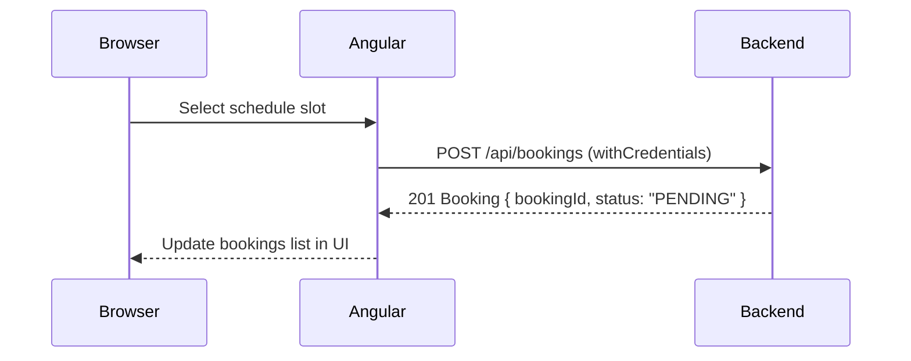

FitWave separates concerns cleanly into two layers: an Angular 21 single-page application that handles all UI and state, and a REST API backend that owns persistence and authentication. The two communicate over HTTP — all requests go to `http://localhost:8080`.

## Frontend stack

| Technology | Version | Role |
|---|---|---|
| Angular | 21 | SPA framework, routing, dependency injection |
| TailwindCSS | v4 | Utility-first styling |
| DaisyUI | v5 | Component library built on Tailwind |
| Vitest | v4 | Unit testing |
| TypeScript | ~5.9 | Language |

## Application structure

The root component (`App`) bootstraps the Angular module. All navigation is handled by `AppRoutingModule` using the Angular Router.

```typescript
// Route table — src/app/app-routing-module.ts
const routes: Routes = [
  { path: 'home',               component: HomeComponent, canActivate: [HomeGuard] },
  { path: 'login',              component: LoginComponent },
  { path: 'create-acount',      component: CreateAcountComponent },
  { path: 'user-dashboard',     component: DashboardUserComponent },
  { path: 'admin-dashboard',    component: DashboardAdminComponent },
  { path: 'dashboard/users',    component: UserComponent },
  { path: 'create-admin',       component: CreateAdminComponent },
  { path: 'dashboard/horarios', component: ScheduleComponent },
  { path: 'dashboard/reservas', component: BookingComponent },
  { path: '**',                 redirectTo: 'home' },
];
```

## Authentication

Authentication is session-based. After a successful login the server sets an HTTP-only session cookie. Every subsequent request that requires an authenticated session includes the cookie automatically because all `HttpClient` calls use `{ withCredentials: true }`.

`AuthService` manages the session lifecycle and exposes the current user as a `BehaviorSubject`.

| Method | HTTP | Endpoint |
|---|---|---|
| `registerUser()` | `POST` | `/api/auth/user-register` |
| `authenticateUser()` | `POST` | `/api/auth/user-auth` |
| `getSession()` | `GET` | `/api/auth/me` |
| `logout()` | `POST` | `/api/auth/logout` |

`getSession()` is called on app initialisation to restore the current user from an active session. It returns `null` on a `401`, which the app treats as unauthenticated.

## Role-based routing

After login, the `roles` array on the `CurrentAuthUser` object determines the redirect target:

- Regular members → `/user-dashboard`
- Administrators → `/admin-dashboard`

The `HomeGuard` protects the `/home` route and redirects unauthenticated visitors.

## Angular services

Each domain has a dedicated injectable service. All services call the backend at `http://localhost:8080`.

### GymClassService

Manages gym class records.

| Method | HTTP | Endpoint |
|---|---|---|
| `getClasses()` | `GET` | `/api/classes` |
| `createClass()` | `POST` | `/api/classes` |
| `deleteClass()` | `DELETE` | `/api/classes/:id` |

### BookingService

Handles class bookings for members.

| Method | HTTP | Endpoint |
|---|---|---|
| `getAllBookings()` | `GET` | `/api/bookings` |
| `getByUserId()` | `GET` | `/api/bookings/:userId` |
| `createBooking()` | `POST` | `/api/bookings` |
| `cancelBooking()` | `PATCH` | `/api/bookings/:id/cancel` |

### ScheduleService

Manages weekly class schedules, including room assignment and slot capacity.

| Method | HTTP | Endpoint |
|---|---|---|
| `getAllSchedules()` | `GET` | `/api/schedules` |
| `getScheduleById()` | `GET` | `/api/schedules/:id` |
| `createSchedule()` | `POST` | `/api/schedules` |
| `updateSchedule()` | `PUT` | `/api/schedules/:id` |
| `deleteSchedule()` | `DELETE` | `/api/schedules/:id` |

### TrainerService

Creates and removes trainer profiles linked to gym classes.

| Method | HTTP | Endpoint |
|---|---|---|
| `getTrainers()` | `GET` | `/api/trainers` |
| `createTrainer()` | `POST` | `/api/trainers` |
| `deleteTrainer()` | `DELETE` | `/api/trainers/:id` |

### UserService

Admin-only service for listing and disabling member accounts.

| Method | HTTP | Endpoint |
|---|---|---|
| `getAllUsers()` | `GET` | `/api/user` |
| `disableUser()` | `PUT` | `/api/user/disable-user/:email` |

## Data models

All interfaces live under `src/app/interfaces/`.

```typescript
// current-auth-user.ts — authenticated session user
export interface CurrentAuthUser {
  id?: number;
  firstName: string;
  lastName: string;
  email: string;
  roles: string[];
  createdAt: string;
  updatedAt: string;
  enabled: boolean;
}

// created-user.ts — registration payload
export interface CreatedUser {
  firstName: string;
  lastName: string;
  email: string;
  password: string;
  roles: string[];
}

// user-response.ts — user record returned by UserService
export interface UserResponse {
  firstName: string;
  lastName: string;
  email: string;
  roles: string[];
  createdAt: string;
  updatedAt: string;
  enabled: boolean;
}
```

```typescript
// gym-class.ts
export interface GymClass {
  id: number;
  title: string;
  description: string;
  difficulty: string;
  trainerId: number;
  trainerName: string;
}

// trainer.ts
export interface Trainer {
  id?: number;
  name: string;
  specialty: string;
  bio: string;
}
```

```typescript
// schedule.ts — a single weekly time slot for a class
export interface Schedule {
  scheduleId?: number;
  dayOfWeek: number;       // 1 = Monday … 7 = Sunday
  startTime: string;       // "HH:mm:ss"
  endTime: string;         // "HH:mm:ss"
  room: string;
  totalSlots: number;
  occupiedSlots: number;
  gymClassId: number;
}

// booking.ts
export interface Booking {
  bookingId?: number;
  bookingDate?: string;
  status: 'PENDING' | 'CONFIRMED' | 'CANCELLED';
  userId: number;
  scheduleId: number;
}
```

<Note>
  `Schedule.occupiedSlots` is maintained by the backend. The frontend reads it to display available capacity but does not write to it directly — cancelling or creating a booking triggers the backend to adjust the count.
</Note>

## Request flow example

The sequence below shows what happens when a member books a class.



## API base URL

All services hard-code the same base URL. Configure your backend to listen on this address during local development:

```typescript
// Example from AuthService
back_url = 'http://localhost:8080/api/auth/';
```

<Warning>
  The API base URL is currently hard-coded in each service file. To target a different environment (staging, production), update the URL in each service or introduce Angular environment files.
</Warning>
